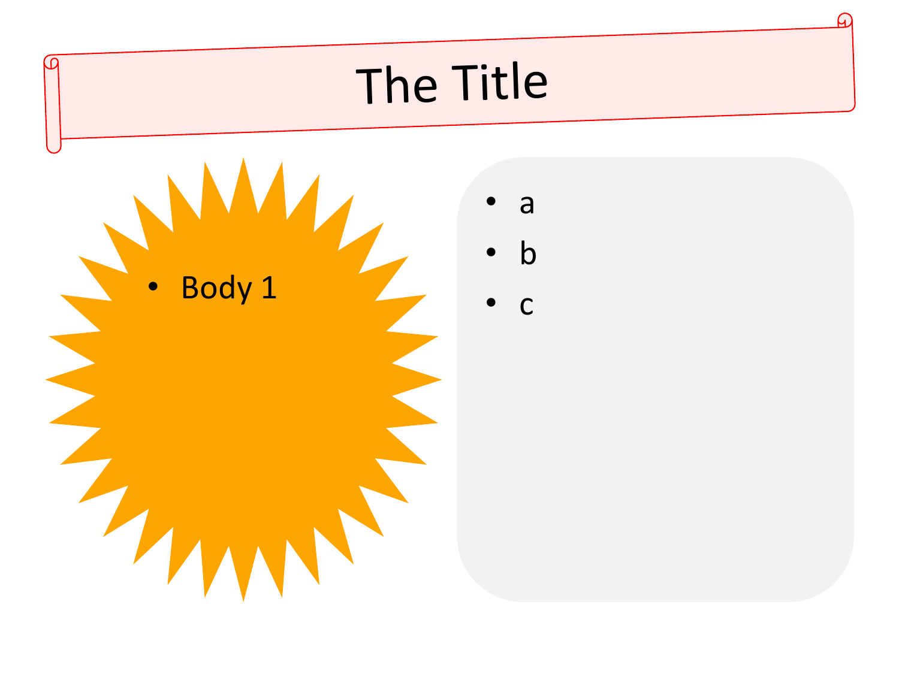
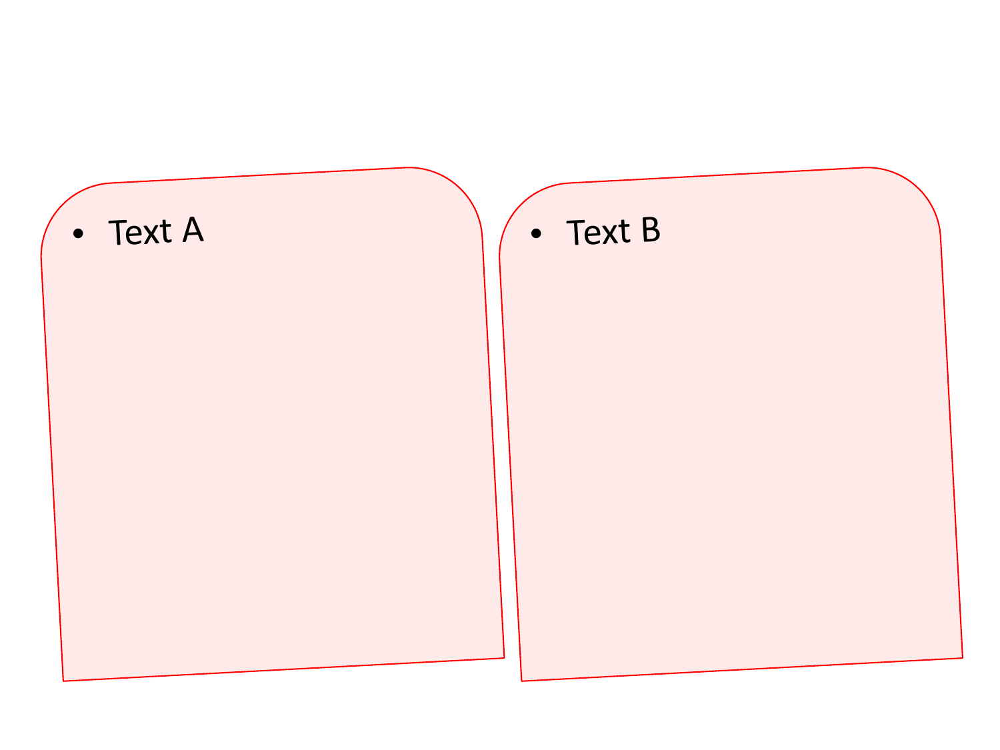
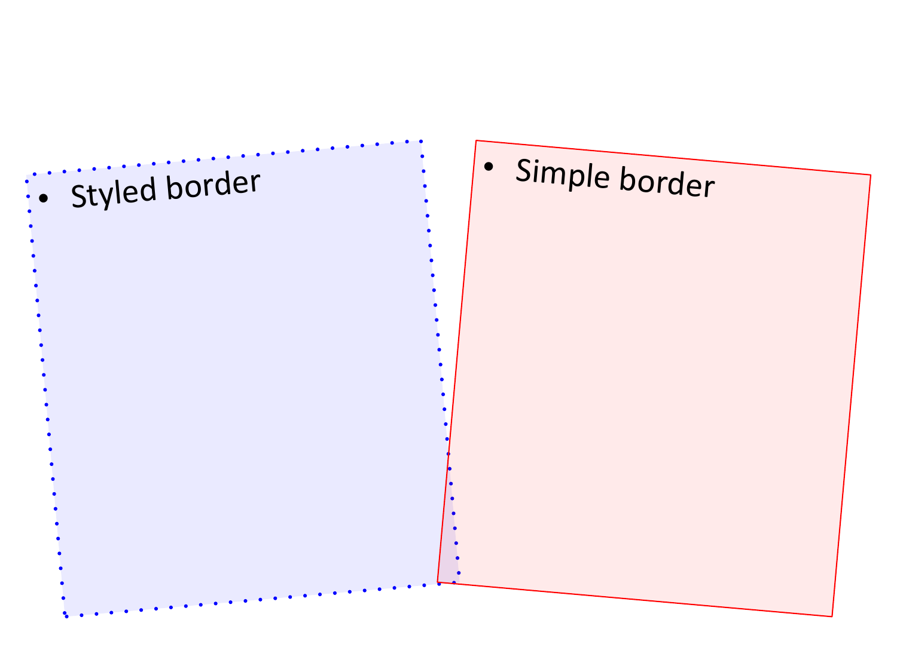
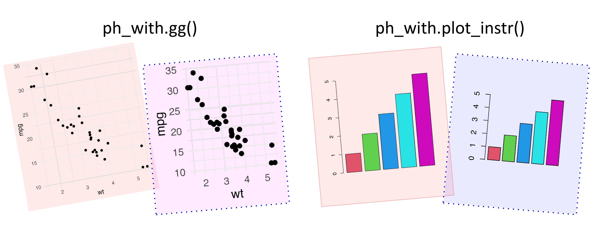

```{r setup, include = FALSE}
knitr::opts_chunk$set(
  collapse = TRUE,
  comment = "#>"
)
library(officer)
```

## Overview

The `ph_with()` methods now accept additional arguments via `...` that modify
the placeholder's visual properties directly. This avoids having to construct
complex `ph_location_*()` objects for simple styling changes.

The supported modifiers are:

| Argument | Description | Example |
|----------|-------------|---------|
| `bg`     | Background color | `"cyan"`, `"#ff000015"` |
| `ln`     | Line/border (color string or `sp_line()`) | `"red"`, `sp_line(color = "blue", lwd = 2)` |
| `rot`    | Rotation in degrees | `5`, `-10` |
| `geom`   | Shape geometry | `"roundRect"`, `"star32"` |

These arguments can be passed individually via `...` or bundled as a named list
via `.dots`.

## Basic example

```{r eval = FALSE}
library(officer)

read_pptx() |>
  add_slide("Two Content") |>
  ph_with(
    location = "title",
    "The Title",
    ln = "red", rot = 2, geom = "horizontalScroll", bg = "#ff000015"
  ) |>
  ph_with(
    location = "body[1]",
    "Body 1",
    geom = "star32", bg = "orange"
  ) |>
  ph_with(
    location = "body[2]",
    letters[1:3],
    geom = "roundRect", bg = "grey95"
  ) |>
  print(target = tempfile(fileext = ".pptx"))
```

```{r echo = FALSE, out.width = "100%"}

```

## Using `.dots` for reusable styling

When applying the same modifiers across multiple placeholders, collect them in
a list and pass via `.dots`:

```{r eval = FALSE}
style <- list(ln = "red", rot = 3, geom = "round2SameRect", bg = "#ff000015")

read_pptx() |>
  add_slide("Two Content") |>
  ph_with(location = "body[1]", "Text A", .dots = style) |>
  ph_with(location = "body[2]", "Text B", .dots = style) |>
  print(target = tempfile(fileext = ".pptx"))
```

```{r echo = FALSE, out.width = "100%"}

```

## Modifiers with different content types

The `...` modifiers work with all `ph_with.*` methods:

```{r eval = FALSE}
library(ggplot2)

fp <- fpar(ftext("Styled text", prop = fp_text_lite(color = "red", font.size = 24)))
p <- ggplot(mtcars, aes(wt, mpg)) + geom_point() + theme_minimal()

read_pptx() |>
  add_slide("Two Content") |>
  # character

  ph_with(location = "body[1]", "Hello", bg = "cyan", rot = 5) |>
  # numeric
  add_slide("Two Content") |>
  ph_with(location = "body[1]", 1:3, bg = "#00ff0015", geom = "roundRect") |>
  # fpar
  add_slide("Two Content") |>
  ph_with(location = "body[1]", fp, ln = "blue", rot = -3) |>
  # ggplot
  add_slide("Two Content") |>
  ph_with(location = "body[1]", p, bg = "#ff000015", rot = 2) |>
  print(target = tempfile(fileext = ".pptx"))
```

## Using `sp_line()` for advanced borders

For more control over the border, pass an `sp_line()` object:

```{r eval = FALSE}
my_line <- sp_line(color = "blue", lty = "dot", linecmpd = "dbl", lwd = 3)

read_pptx() |>
  add_slide("Two Content") |>
  ph_with(
    location = "body[1]",
    "Styled border",
    ln = my_line, bg = "#0000ff15", rot = 5
  ) |>
  print(target = tempfile(fileext = ".pptx"))
```

```{r echo = FALSE, out.width = "100%"}

```

## Images and plots with modifiers

Modifiers can also override position (`left`, `top`) and combine with
`sp_line()` borders. Multiple `ph_with()` calls on the same slide stack
content with different styles:

```{r eval = FALSE}
library(ggplot2)

my_line <- sp_line(color = "blue", lty = "dot", linecmpd = "dbl", lwd = 3)
anyplot <- plot_instr(code = barplot(1:5, col = 2:6))

p <- ggplot(mtcars, aes(wt, mpg)) +
  geom_point() +
  theme_minimal(base_size = 15) +
  theme(
    plot.background  = element_rect(fill = "transparent", colour = NA),
    panel.background = element_rect(fill = "transparent", colour = NA)
  )

read_pptx() |>
  # ggplot with rotation, bg, position override and sp_line border
  add_slide("Two Content", title = "ph_with.gg()") |>
  ph_with(p, "body", rot = 10, bg = "#ff000015") |>
  ph_with(p, "body", rot = 5, left = 5, top = 2, bg = "#ff00ff15", scaling = 2, ln = my_line) |>
  # plot_instr with multiple placements
  add_slide("Two Content", title = "ph_with.plot_instr()") |>
  ph_with(anyplot, "body", rot = 5, bg = "#ff000015", ln = "#ff000060") |>
  ph_with(anyplot, "body", rot = -5, left = 5, top = 2, bg = "#0000ff15", ln = my_line, scaling = 1.5) |>
  print(target = tempfile(fileext = ".pptx"))
```

```{r echo = FALSE, out.width = "100%"}

```

The same modifiers also work with `external_img()`:

```{r eval = FALSE}
img_file <- system.file("img", "dog2.png", package = "officer")
ext_img <- external_img(img_file, width = 4, height = 3)

read_pptx() |>
  add_slide("Two Content", title = "ph_with.external_img()") |>
  ph_with(ext_img, "body", use_loc_size = FALSE, rot = 10, bg = "#ff000015") |>
  ph_with(ext_img, "body", use_loc_size = FALSE, rot = -10, left = 5, top = 2.5, bg = "#ff00ff15") |>
  ph_with(ext_img, "body", use_loc_size = FALSE, rot = 5, left = 3, top = 4, bg = "#0000ff15", ln = my_line) |>
  print(target = tempfile(fileext = ".pptx"))
```

## Notes

- For `ph_with.gg()`, `ph_with.plot_instr()`, and `ph_with.external_img()`,
  the `geom` modifier has no visible effect since these render as images.
- For `ph_with.data.frame()`, modifiers `geom`, `ln`, `bg`, and `rot` have no
  visible effect since tables use their own styling.
- The `...` arguments take precedence over properties set in the location object.
