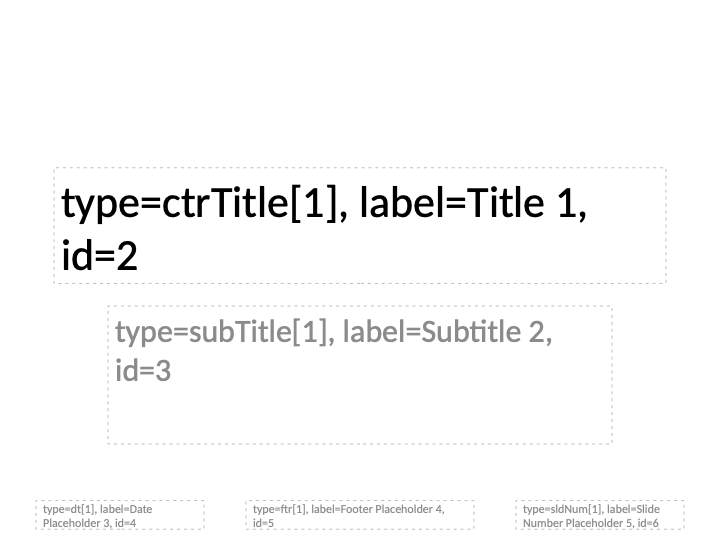
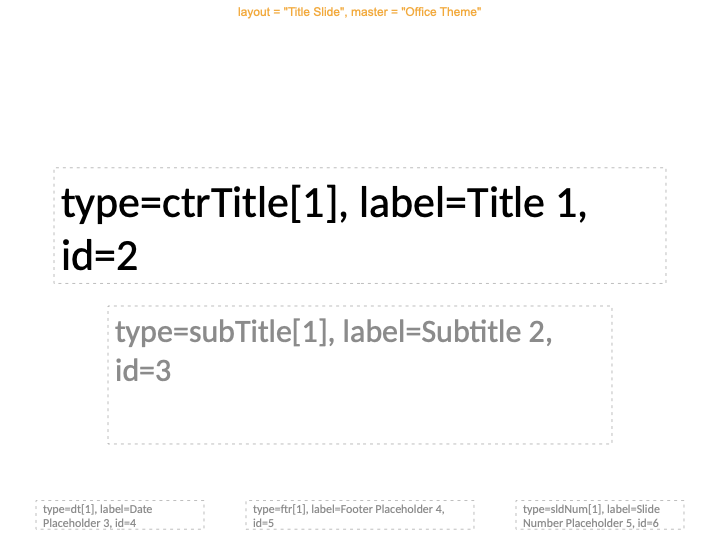

```{r setup, include = FALSE}
knitr::opts_chunk$set(
  collapse = TRUE,
  comment = "#>"
)
library(officer)
```

## Overview

When working with PowerPoint templates, the first task is usually to identify
which placeholders are available and how to reference them. officer provides
several tools for this:

| Function | Use case |
|----------|----------|
| `phs_annotate()` | Annotate phs on the current slide (interactive) |
| `add_annotated_layouts()` | Add annotated layout overview slides |
| `annotate_base()` | Generate a full annotated layout file |
| `plot_layout_properties()` | Plot layout as R graphic |

## Interactive workflow with `phs_annotate()`

`phs_annotate()` adds annotation text (type, label, id) directly into the
placeholders of the current slide. Combined with `print(preview = TRUE)`, this
gives immediate visual feedback:

```{r eval=FALSE}
read_pptx() |>
  add_slide("Title Slide") |>
  phs_annotate() |>
  print(preview = TRUE)
```

```{r echo=FALSE, out.width="80%"}

```

### Annotating specific placeholders

You can select which placeholders to annotate using short-form syntax:

```{r eval=FALSE}
read_pptx() |>
  add_slide("Two Content") |>
  phs_annotate("Title 1", "body[1]") |>
  print(preview = TRUE)
```

### Annotating multiple slides

Use `.slide_idx` to annotate specific slides or all slides at once:

```{r eval=FALSE}
x <- read_pptx()
x <- add_slide(x, "Title and Content")
x <- add_slide(x, "Two Content")
x <- phs_annotate(x, .slide_idx = "all")
```

### Customizing appearance

```{r eval=FALSE}
read_pptx() |>
  add_slide("Title Slide") |>
  phs_annotate(
    .font_color = c(type = "blue", label = "red", id = "darkgreen"),
    .bg = "#ff000010",
    .line = sp_line(color = "grey", lwd = 1, lty = "dash")
  ) |>
  print(preview = TRUE)
```

Show only labels (hide type and id):

```{r eval=FALSE}
read_pptx() |>
  add_slide("Title Slide") |>
  phs_annotate(.font_size = c(type = 0, id = 0), .keys = FALSE) |>
  print(preview = TRUE)
```

## Layout overview with `add_annotated_layouts()`

To get an overview of all layouts in a template, use `add_annotated_layouts()`.
It adds one slide per layout with annotated placeholders:
 
```{r eval=FALSE}
read_pptx("my_template.pptx") |>
  add_annotated_layouts() |>
  print(preview = TRUE)
```

Select specific layouts by name or index:

```{r eval=FALSE}
read_pptx() |>
  add_annotated_layouts(layouts = c("Title Slide", "Two Content")) |>
  print(preview = TRUE)
```

## Quick file generation with `annotate_base()`

`annotate_base()` is a convenience wrapper that creates a standalone annotated
file. It reads the template, adds annotated layout slides, and writes the result:

```{r eval=FALSE}
annotate_base("my_template.pptx", output_file = "annotated_layouts.pptx")
```

```{r echo=FALSE, out.width="80%"}

```

Without file output:

```{r}
x <- annotate_base(output_file = NULL)
length(x) # one slide per layout
```

## Reading the annotations

Each placeholder annotation shows three pieces of information:

- **type**: the placeholder type with index, e.g. `body[2]`
- **label**: the placeholder label, e.g. `Content Placeholder 2`
- **id**: the numeric placeholder id, e.g. `3`

Use these values with the `ph_location_*()` functions:

```{r eval=FALSE}
# By label
ph_location_label(ph_label = "Content Placeholder 2")

# By type + index
ph_location_type(type = "body", type_idx = 2)

# By id
ph_location_id(id = 3)

# Short-form in phs_with()
phs_with(x, `Content Placeholder 2` = "text", `body[2]` = "text", `3` = "text")
```
